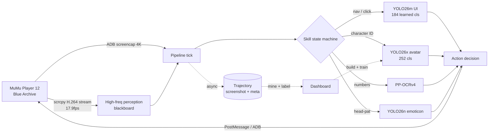

# Blue Archive Daily Assistant

**它是什么**:一个在你自己电脑上运行的《蔚蓝档案》AI 助手。它像人一样"看"模拟器画面(AI 视觉识别按钮和角色),像人一样点击操作——每天自动帮你收咖啡厅、扫荡关卡、打竞技场、领邮件和任务奖励,新活动还能自动推图、按加成规划体力。不改游戏、不上云,纯本地。

**铁律**:绝不花你的青辉石或真钱——所有涉及货币的操作都有多层拦截,读不出余额就宁可不做。

**它现在能做什么**(2026-07 实测):
- ✅ 每日全套日常:收菜(免费包/社团/制造/商店/课程表/咖啡厅摸头)→ 悬赏/交流会/竞技场 → 活动优先吃光体力 → 邮件+每日任务收尾——主链已全面视频流化,响应 7 tick/s(升级前 1 tick/s)
- ✅ 新活动开荒:自动跳剧情、推 Story/Quest 关、按"活动>双倍>普通"规划体力、盘点活动商店算 farm 计划
- ✅ 实时战斗感知:scrcpy 视频流 17.9fps(帧龄 0.02 秒、不怕窗口遮挡)+ 19 类战斗检测(我方/敌方/5 种 Boss/胜利/HUD 全套)+ 技能卡角色识别
- ✅ AI 自己打战斗:行为树控牌(急救>集火 Boss>AOE 清群>单体循环)+ 闭环拖拽瞄准(按住后持续跟踪目标再松手),活动 Boss 关实战 71-91 秒通关
- 🧱 架构升级中(L1→L3):列表结构化解析已上线(台账主键从**屏幕坐标**改成**关号**)、页面图 + BFS 路径规划已上线但**只观测不接管**(实测覆盖率还不够,不敢交导航)、竣工判据 `CLEAN/LEFTOVER/UNKNOWN` 三态已上线——bot 现在会在每个 skill 出口自己喊“活没干干净”,不用等人肉眼发现
- 🚧 进行中:总力战抄轴(视频轴表→自动执行)、日常全链路视频流化(高频感知线程已上线)、UI 模型 val 补齐(184 个已学会的类里有 55 类没 val 量尺)

## At a Glance

| | |
|---|---|
| **Platform** | Windows 10 / 11, NVIDIA GPU |
| **Game runtime** | MuMu Player 12 |
| **Daily** | `DailyRoutine` (10 sub-skills) + event planner + sweep chain |
| **Vision** | YOLO26m UI `v14` (485-wide head, **184 classes learned**) + YOLO26x avatar `v6` (252-cls) + YOLO26s battle `v10` (19-cls) + YOLO26n emoticon |
| **OCR** | PP-OCRv4 fine-tuned on BA glyphs — numeric fields only (all page/button *decisions* are pure YOLO cls as of 2026-07) |
| **Battle** | scrcpy feed 17.9fps (occlusion-proof) → blackboard → behavior-tree card-play (shipped: event boss 71-91s clears) + ByteTrack lock (ally idsw -66%) |
| **Safety** | structural purchase-dialog gate (quantity-stepper signal, orthogonal to icon detection) + non-lobby pyroxene sentinel + per-game-day dispatch ledger |
| **Self-audit** | `exit_report()` completion verdicts · `scripts/audit_cls_usage.py` dead-predicate scan · 13 logic regression fixtures |
| **Tooling** | Annotation dashboard (class mgmt / video→frames→prefill / timeline sheets) |

## How It Works



## Vision Stack

| Tier | Model | Job | Latency |
|---|---|---|---|
| **UI** (primary) | YOLO26m `ui_v14` (**184 learned classes**, 485-wide head) | every button / tab / popup / badge → drives all nav + clicks; in-game flywheel-trained | ~6 ms |
| Avatar ID | YOLO26x `fused_avatar_v6` (252-cls) | bbox + character ID in one pass + in-battle skill-card recognition (incl. grayed-out / charging) | ~10 ms |
| Numeric OCR | PP-OCRv4 BA-tuned | AP / ticket / count digits only | ~50 ms |
| Head-pat | YOLO26n `emoticon` | cafe head-pat bubble | ~2 ms |
| Battle | YOLO26s `battle_v10` (19-cls) | ally / enemy / 5 boss forms / victory / full HUD — trained on emulator runs **+ community strategy videos** (download→frames→track-prefill→human review flywheel) | ~12 ms |

Active versions are resolved at runtime from `data/model_registry.json`, so shipping a model is a one-line `active` bump — and rolling back is just as fast. Each detector infers at its training `imgsz` (960 for the UI / avatar models). `cv2.matchTemplate` / HSV survive as cheap fallbacks for a few stable glyphs.

**Why pure-YOLO (OCR demoted):** the pipeline used to navigate by OCR text + template match, which broke on font rendering, localization and resolution. Disabling OCR for navigation forced every click path through a trained class — navigation is now resolution- and scale-independent, and a miss is an honest "class not detected" instead of a silent mis-click.

## Daily Skills

`DailyRoutine` runs ten sub-skills in order; each finds its target by class and clicks the returned box. Money paths are gated **structurally** (right column), never by trust in a single detection.

| # | Skill | Does | Money / fallback guard |
|---|---|---|---|
| 1 | BuyPyroxene | claim daily free pack | confirm **only if `免费` present**, else cancel |
| 2 | Club | check-in for AP | card miss → red-dot offset |
| 3 | Craft | claim + queue craft | "finish-now" ticket dialog → cancel |
| 4 | Shop | affordable credit buys | **fail-closed**: buy/confirm only while `信用点商店_已选中` is positively detected; balance ≥ reserve |
| 5 | Cafe | income / invite / head-pat | NAV miss → bottom-bar extrapolation |
| 6 | Schedule | lesson dispatch, favorite-first | ticket OCR=0 → exit; pyroxene in dialog → cancel |
| 7 | MomoTalk | clear unread bond chats | — |
| 8 | StoryMining | mine unplayed story nodes | battle node (SORTIE/SQUAD) → back, spend no AP |
| 9 | Mail | claim all rewards | entry clicked only from lobby |
| 10 | DailyMission | claim dailies (runs last) | unlocked only after the rest finish |

`CampaignSweep` enters the mission hub once and delegates to bounty / arena (+ event when active). Global popups (rewards, level-up, exit / disconnect dialogs) are dismissed once in the pipeline interceptor by class — a backable modal via 取消 / X, never ESC (ESC could confirm the exit-game dialog).

## Battle Lock

A Kalman **predict → correct** tracker over YOLOv8n head detections, rendered to a Win32 layered overlay. Three things give it the external-grade feel:

- **One-Euro smoothing** — heavy when the target is slow (no jitter), light when fast (no lag).
- **Predictive lead-aim** — the box is drawn where the target *will* be (`position + velocity × end-to-end latency`), hiding the ~30–50 ms capture→render lag. Clamped so a noisy velocity spike can't fling it; off by default for static UI overlays.
- **Velocity coast + ByteTrack rescue** — an unmatched track glides on its decayed velocity through a VFX flash that tanks confidence; the low-conf second stage re-acquires the moment the head reappears.

## Dashboard

A FastAPI + WebView2 app for running the bot and iterating models:

- **Agent / HUD** — profile, skill order, AP / favorites, dry-run toggle; live pipeline state (current skill, sub-state, last action reason).
- **Capture** — DXcam capture with split routing to `train` runs or per-purpose held-out val pools, so rare-class samples are never stolen from training.
- **Annotate** — YOLO / OCR labeling hardened for long sessions: 50-step undo/redo, cross-frame paste, LRU prefetch for 0-latency paging, loss-proof saves, find-by-class, and model-assisted prefill (`YOLO预填` overlays the active model on a whole run so weak classes get their first samples).
- **Synth Templates** — visual per-context slot editor (axis-aligned rect or free 4-point quad), ref-crop preview, augmentation anchors, bbox modes, live preview — the heart of avatar / skill-card data generation.
- **Trajectories** — per-tick replay (screenshot, OCR, YOLO, action, reason).

## Models & Iteration

What actually moved the needle, learned across UI v1→v5 and avatar v1→v4:

- **Spatial augmentation** (mosaic / copy_paste / scale / translate / hsv_v) breaks position- and background-dependence — the core fix for the early overfit where a handful of frames blown up ~200× by oversample made the model memorize backgrounds instead of elements.
- **`fliplr / flipud / degrees = 0`** for UI — left/right is semantic (左切换 ↔ 右切换); flipping corrupts labels.
- **mixup / copy_paste are toxic for fine-grained 252-class ID** — they blend identity features; removed for the avatar model.
- **Synthetic compositing** pastes a rare element / character onto hundreds of real backgrounds — diversity that duplication cannot provide.
- **The small held-out val lies** — it carried zero instances of the weak classes it was meant to measure, and picked the wrong checkpoint. Models ship from a frozen `last.pt` after a real-frame check, not from val-mAP alone.
- **Warm-start** from the previous best preserves learned identity features and roughly halves wall-clock.

**Active** (`data/model_registry.json`): UI `ui_yolo26m_v14` · avatar `fused_avatar_yolo26x_v6` · battle `battle_yolo26s_v10` · emoticon `v26n`.

### Measured model health (2026-07-25)

Counted off the real training sets. **The denominator is "classes that actually
have training boxes", not `nc`** — the UI head is 485 wide only because it is
laid out against the master class list so label files never need id remapping;
301 of those slots have never seen a positive sample. Dividing by 485 makes
every ratio wrong (an error this table's first version shipped with).

| Model | nc | **classes with samples** | val-covered | boxes/class (min · p10 · median) | under 30 boxes |
|---|---|---|---|---|---|
| **UI** `v14` | 485 | **184** | **129 = 70.1%** | 1 · 38 · 344 | 6 (3.3%) |
| avatar `v6` | 252 | 252 | 252 = 100% | 181 · 191 · 198 | 0 |
| battle `v10` | 19 | 19 | 19 = 100% | 17 · 21 · 171 | **5 (26.3%)** |

Read by dimension rather than as one ranking:

- **Measurement gap → UI.** 55 classes that carry real traffic have **no val
  instances at all** (`入场键没解锁` 2141 boxes, `关卡得星_0` 1282, `战斗暂停`
  1158 …). You cannot catch a regression in something you never measure — and
  UI is the only model the daily chain depends on, so this is the one to fix.
- **Sample scarcity → battle**, not UI. 26.3% of its classes sit under 30 boxes
  (all added across v7→v10); UI's figure is 3.3% with a median of 344.
- **avatar is healthy** — full val coverage, a near-flat 181–336 boxes/class
  spread. Nothing to do.
- The 301 empty head slots are waste, not a defect: they cost a retrain plus a
  repo-wide class-id remap to remove, and they do not affect the 184 learned
  classes. Logged as debt.

`py scripts/audit_cls_usage.py --with-det --fail-on-dead` is the standing check:
it cross-references every class against training boxes, code references and live
detections. Its first run found **four money guards in `shop.py` that had never
once fired** — they keyed on a class with zero training boxes and zero live
detections, so a "never buy on the pyroxene tab" check was, in fact, absent.
Fixed by inverting it into a fail-closed whitelist. A blacklist is only worth
anything when the model can actually recognise the bad thing.

**UI v8** (shipped) grows the class map to **469** — adding the full batch-sweep dialog suite (批量扫荡 button/start/plan/equipment states) hand-labeled by the operator — and fixes the two long-standing weak spots: red/yellow notification-dot **cross-confusion 348 → 0** (a position-prior poisoning in teacher labels, cured by per-pixel HSV arbitration over 635 labels at the source) and the double/triple-event ribbon **0.03 → 0.51**. Micro-precision 0.993 on the 515-frame all-real val. Shipped from a 14-epoch arrow-rehearsal finetune (`v8b`), checkpoint picked by real-val peak with a full per-class regression scan against v7 — which surfaced one honest lesson: the val set's lobby arrows all wore a since-replaced memorial-lobby skin, so the headline arrow recall reads 0.06 on a dead domain while live frames from the last four days score 90%. Skin-dependent UI elements get synthetic-compositing insurance in the next cycle.

**UI v7** (previous) was the first pure-UI flywheel retrain: by-class recall 0.83 → 0.92 on the real 477-frame val, craft-entry 0→0.97. Kept in the registry — rollback is a one-line `active` flip.

**Avatar v6** (shipped) extends the 252-head detector to in-battle **EX skill cards** — the bottom-row character cards, including the grayed-out *insufficient-cost* state with its clock-wipe charge sweep — built from a template-synth pipeline with multi-background backgrounds and domain-accurate gray/sector augmentation. On held-out real frames: skill-card recall **0.85** (vs the prior cards-capable run's 0.56) while non-battle recognition (cafe / formation) holds at mAP50 **0.99**. The shipped checkpoint is the *real-val peak*, picked on a manual val set rather than the synth-inflated nominal best (later epochs overfit the synthetic cards).

**In progress:**

- **Batch-sweep skill** — the v8 dialog classes get their real acceptance test as a live skill walk (MAX → sweep → claim).
- **Synthetic arrow hardening** — skin-dependent elements (lobby arrows et al.) composited over diverse backgrounds so the next lobby-skin change can't break them.
- **Battle skill-card AI** — the detector now *sees* the cards (incl. gray/charging); a combat policy that *reads* them (cost-aware skill rotation) is the next layer. (The unified single-model path is parked: per-domain specialists keep winning on measurement.)

## Architecture: L1 → L3

The skills started as hand-written state machines that navigate by hard-coded
`back` / `nav_home` and key their bookkeeping off screen coordinates. Three
layers are replacing that, bottom-up. **L1 is the perception layer, L2 the
decision layer, L3 the self-check layer.**

### L1 — from *boxes* to *structure*

| Item | State | What shipped |
|---|---|---|
| digit-OCR frame cache | done | …and **measured worthless**: 600 ticks → 30 real reads, 1 cache hit, 0.8 s saved. Kept (harmless), recorded as a disproved optimisation. |
| **List → structured rows** | **done** | Quest rows now parse to `{num, cy, enter, star}`. The ledger key moved from **cy to quest number**. |
| quest/challenge discriminator | partial | Solved with a positive anchor + regression fixture instead of the planned classifier; classifier downgraded. |
| whole-frame page classifier | not started | Downgraded to optional — L2's rule fingerprints work without it. |

The row parser is the load-bearing one. The bonus ledger used to persist as
`{"0.397": true, "0.871": true}` — **screen coordinates as identity**. Scroll the
list and every key is wrong, and `unlock` picked its target by nearest-cy, so a
shifted list meant spending 20 AP unlocking the wrong stage *and* recording the
right one as done. Quest numbers are read by anchoring on the trained
`关卡得星_3` box and OCR-ing the strip directly above it — measured across the
whole corpus (479 real event-list frames): **100% per-cell read rate, 100% of
frames strictly increasing**, 0 errors. Coordinates are now allowed for *clicking
and same-frame dedup only*; identity is the number, and that rule is written into
the code.

### L2 — from *hand-written navigation* to a *page graph*

`brain/nav/page_graph.py`: 29 pages with class fingerprints, 22 observed
transition edges, BFS routing. Built from `data/screen_flow_draft.md` (1029 clean
frames clustered into page groups, edges harvested from recorded click→frame
transitions).

**Shipped read-only, on purpose.** Measured over 92,855 frames: coverage 26.6%,
contradiction rate 1.33%, temporal consistency 67.1% — not good enough to hand
navigation over, so it currently only logs what page it thinks we are on next to
what the skill thinks it is doing. Low coverage is a missing-pages problem
(Mail / DailyMission / MomoTalk / Craft / Story / in-battle were never captured
in the source frames), so the fix is more pages, not a lower threshold.

Three things that only showed up because it was measured before being trusted:

- A `require` field had to be added: with a count threshold alone, two generic
  classes (`扫荡开始` + `任务开始`) satisfied the bounty sweep panel and the
  **ticket type never participated in the decision** — 219 event-sweep frames
  were being identified as bounty. Pages distinguished by one specific object
  need that object *required*, not merely counted.
- A vocabulary validator caught two class names I had typed wrong. A misspelled
  class is a predicate that can never fire, silently.
- Most remaining "contradictions" turned out to be **wrong labels, not a wrong
  graph** — and were left alone rather than papered over. That the graph spots
  "the skill thinks it is on X while the screen is on Y" is precisely its value.

The graph also *declines* to judge what it cannot: confirm dialogs (sweep /
event-shop / AP-purchase / quit share nearly identical class sets) return
`ConfirmDialog_ambiguous` for the structural money gates to resolve, and
X-button-only or empty frames return UNKNOWN instead of being forced into a class.

### L3 — self-check

Not started; it needs L2 coverage first. `exit_report()` (below) is a *sibling*
of it, not L3 itself — it audits resources, not page reachability.

### Completion assertions

Every skill answered "did my loop finish?" and none answered **"is the work
actually done?"** — which is why 5 lesson tickets, 253 AP and two zero-sweep days
were caught by the operator rather than by the bot. `BaseSkill.exit_report()`
now returns `CLEAN` / `LEFTOVER` / `UNKNOWN` at skill exit, printed and stored on
`SkillResult`. `UNKNOWN` is kept strictly separate from `CLEAN`: "couldn't read
it" and "confirmed nothing left" are different failures (perception vs strategy),
and collapsing them into a boolean makes the difference unrecoverable. Skills
that declare nothing default to `UNKNOWN` — never to `CLEAN`.

### Wall-clock, not ticks

A family of timeouts was written as tick counts back when a tick was ~1.6 s.
After the zero-wait rework a tick is **0.15–0.25 s**, so a story battle's
"~2 min" hold was really 18–30 s and timed out *into* a blind back-press
mid-battle; craft's collect settle was 0.6–1.0 s against a popup that needs
2.5–3 s, quietly voiding an earlier fix. All converted to
`BaseSkill.mark/since/expired`. Measuring that rate has its own trap: the mean
across runs is polluted by step-mode operator pauses, so the fast end is what
matters — a timeout fires *earliest* when ticks are fastest.

## Quick Start

### Requirements

Windows 10/11 · Python 3.11+ · [MuMu Player 12](https://mumu.163.com/) running Blue Archive · NVIDIA GPU (RTX 3060+ for the battle lock; the daily pipeline is CPU-bound).

### Install

```powershell
git clone https://github.com/C0k11/blue-archive-assistant.git
cd blue-archive-assistant
pip install -r requirements.txt
```

### Run

```powershell
# Launcher (recommended): download GameSecretaryApp.exe from Releases and double-click.
# Terminal:
py -m uvicorn server.app:app --host 127.0.0.1 --port 8000
# then open http://127.0.0.1:8000/dashboard.html

# Combat 2.0 (scrcpy blackboard + behavior-tree card play):
py -u scripts/bot_play_quest.py 10 11 12
```

### Train / iterate a model

Build data in the dashboard (Capture + Annotate), then:

```powershell
py scripts/build_fused_avatar_dataset.py        # avatar / skill-card dataset (synth + manual + neg)
py scripts/train_yolo26.py fused_avatar_26x_v4  # train a registered config
py scripts/eval_fused_avatar_report.py          # per-frame HTML eval
# ship: freeze weights, bump the active version in data/model_registry.json
```

## Repository Layout

```
ai-game-secretary/
├── brain/
│   ├── pipeline.py          # interceptors, model-registry resolve, async trajectory writer
│   └── skills/              # one module per skill
├── vision/                  # OCR normalize, florence (dashboard tooling)
├── server/                  # FastAPI app + dashboard.html
├── scripts/                 # train / build / eval / sweep / shop
│   ├── train_yolo26.py
│   ├── build_fused_avatar_dataset.py
│   ├── build_ui_v2.py
│   ├── bot_play_quest.py
│   └── ocr_training/
├── data/
│   ├── model_registry.json  # active model versions (single source of truth)
│   ├── synth_templates/     # per-context synth JSON
│   ├── raw_images/          # labeled frames + _classes.txt master
│   └── captures/角色头像/   # wiki portrait refs
└── windows_app/             # .NET 8 WebView2 launcher
```

Models, datasets and the HF cache live outside the repo under `D:/Project/ml_cache/` (gitignored).

## License & Disclaimer

Personal / educational use only. No game files are redistributed; assets stay in your own MuMu installation. Not affiliated with Yostar / Nexon / Bilibili / NetEase.
